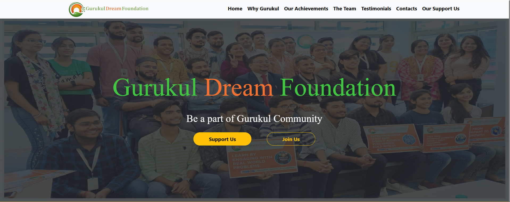
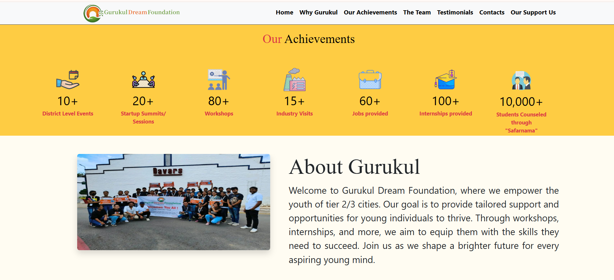
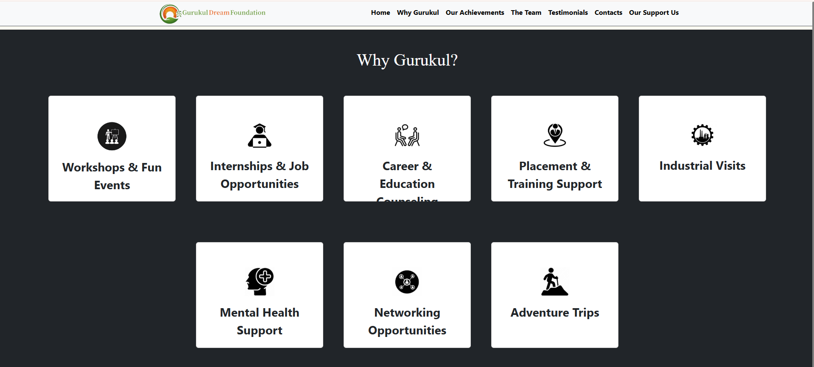
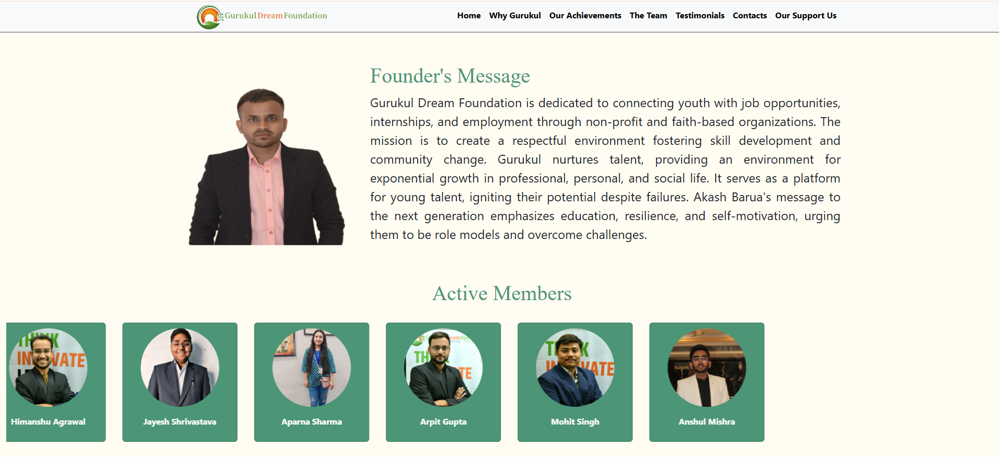

# 🌟 Gurukul Dream Foundation (GDF)

This is the official webpage of Gurukul Dream Foundation.

## 🚀 Getting Started

1. Clone this repo  
2. Open `index.html` in your browser to explore the site.
3. Or visit the [live app here](https://gurukuldreamfoundation.vercel.app)  

## 🖼️ Project Screenshots

Here are some previews of the GDF homepage:

  
    
  
    
  
    
  

## 🛠️ Tech Used

- HTML5  
- CSS3  
- Bootstrap  
- JavaScript

## 🌱 How to Contribute

We welcome contributions! Please follow these steps:

1. Check for open issues  
2. Comment with “I’d like to work on this”  
3. Wait for assignment and approval  
4. Create a feature branch and start coding  
5. Submit a PR following the PR template  

## 📄 Contribution Guidelines

1. Use clear commit messages  
2. Format code before pushing  
3. Keep pull requests focused  
4. Respect other contributors  

## 👥 Contributors

- Anurag Vishwakarma  
- Sumit Rathor  
- Himanshu Singh Kyariya  

## 📃 License

This project is licensed under the MIT License.

## 🙌 Acknowledgements

Thanks to **GirlScript Summer of Code 2025** for the opportunity to contribute.
